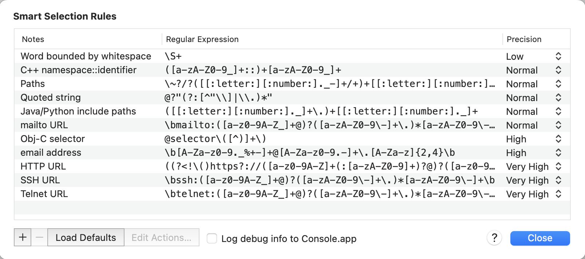
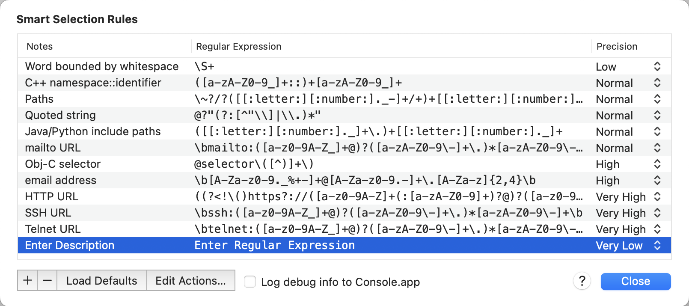
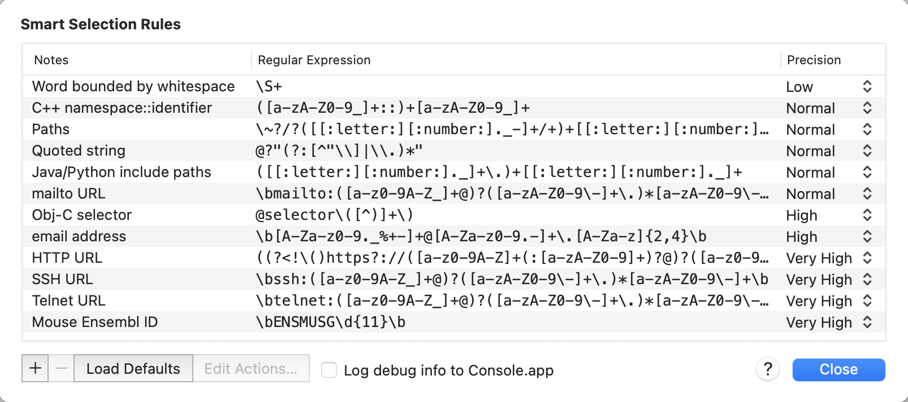
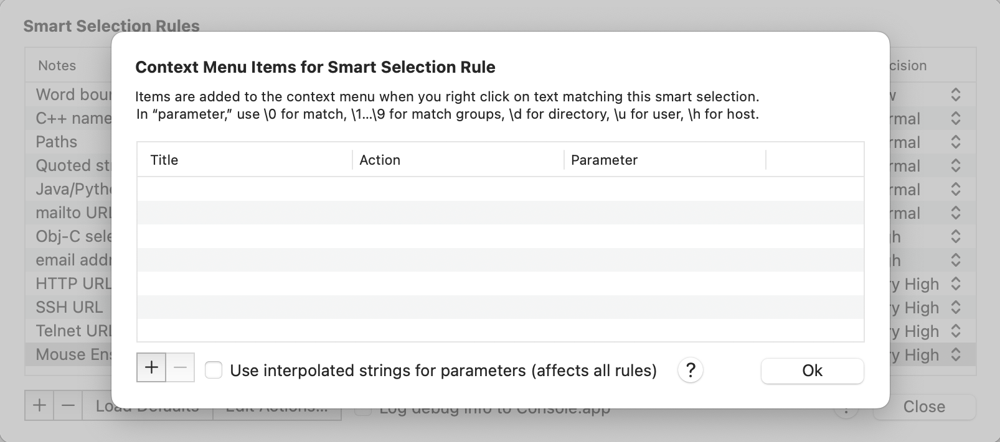
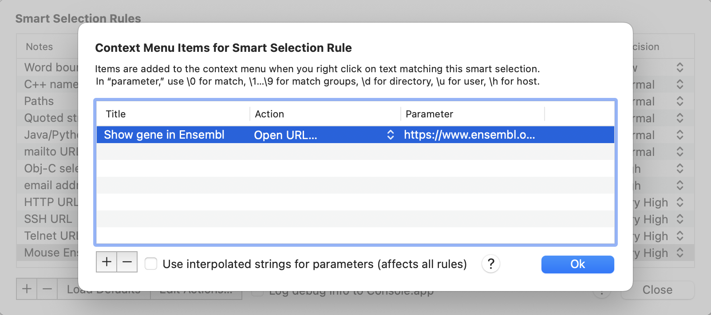
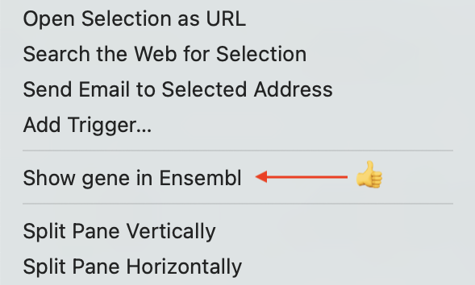

I've been using iTerm2 as the terminal app on my Mac for a while now, and am embarrassed to say that I only exploit a tiny fraction of its capabilities. Here's one that I just learned about – smart selection.

According to the [docs](https://iterm2.com/documentation-smart-selection.html), smart selection "simplifies making selections on semantically recognizable objects." In practice, this means that you can set up regular expressions, and when text in the terminal matches one of these, take actions. Here, for example, is how you can make iTerm2 recognise Ensembl gene IDs, and do something useful with them.

Smart selections are defined deep down in the iTerm2 Settings dialog:

iTerm2 → Settings → Profiles → Advanced → Smart Selection → Edit

Clicking this button summons a slightly intimidating window:



But it's simpler than it seems. We'll click the "+" icon to add a new rule, then in turn click "Enter Description" and "Enter Regular Expression" to edit these:



I've called the new rule "Mouse Ensembl ID" and defined it to match the regular expression:

```
\bENSMUSG\d{11}\b
```

i.e. a word boundary, followed by "ENSMUSG", 11 digits, and another word boundary. I've also set the "Precision" to "Very High". This means that I don't expect this regular expression to produce false positives – everything it matches should be an Ensembl mouse gene ID – and thus I would like it to take precedence over other rules that might match this text:



To add an action, click the "Edit Actions..." button with this rule selected, or just double-click the rule in the table:



Again, clicking the "+" button here allows us to add a menu item that will appear in the context menu when we right click on some text matching our rule. 



There are all kinds of actions you can take, but I've chosen to simply load a URL:

```
https://www.ensembl.org/Mus_musculus/Gene/Summary?g=\0
```

That is, to open the Ensembl gene summary page for the gene – the "\0" substitutes into the URL the whole text which matched our regular expression.

And here it is – now when I right-click on an Ensembl mouse gene ID in the terminal, I get a menu item which will take me directly to that gene's summary page on the Ensembl web site:

{width=50% fig-align="center"}


